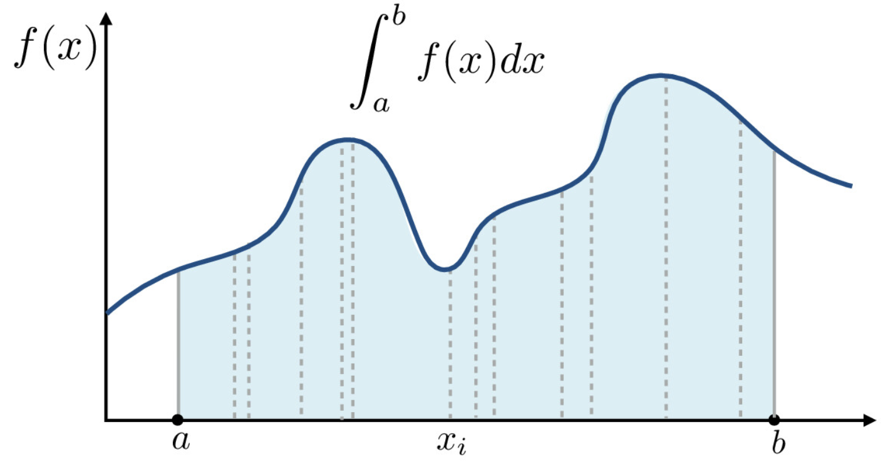

# 🫖 Computer Graphics 

## Rasterization 

### Drawing Triangles 

## Sampling, Aliasing, Antialiasing

## Transforms 

## Texture Mapping 

## Rasterization Pipeline

## Geometry, Splines, Bezier Curves 

## Ray Tracing

## Ray Tracing Acceleration 

## Measuring Light: Radiometry & Photometry 

## Monte Carlo Integration 

Graphics requires lots of integrals so we want to consider how to make estimating integrals shorter. One way to estimate sample integrals is by sampling $f(x)$ at different $x$ positions, using trapezoidal rule or Riemann's. The more samples of $f(x)$ we take, the better our estimate gets. We can use area sampling as a form of antialiasing and estimating the integral of a triangle over the area of a pixel. In order to calculate irradiance from an environment, we integrate over all directions in the hemisphere. In order to calculate motion blur, we integrate over the pixel as well as over exposure time. We can even have a five dimensional integral by integrating over 2D lens pupil, 2D pixel area, and exposure over time.

However, we have to be careful about ==curse of dimensionality==. If we want to take $N$ samples in $5$ dimensions, then we need to take $N^5$ samples. This means our error also scales with respect to this. But if we remember, random sampling has very low error in higher dimensions. When computing infinite dimensional integrals such as for global illumination, Monte Carlo integration will require fewer samples than quad-based numerical integration. 

**Goal**: estimate integrals based on random sampling of functions 
**Pros**: 
- relatively simple
- requires only function evaluation at any point
- works for general functions, even if it has discontinuities 
- efficient for high dimensional integrals 

**Cons**: 
- noise, because we are estimating integral randomly, we will only be correct on average
- can be slow to converge, because we need a lot of samples

### Probability Review

**Discrete Probability Density Functions (PDFs)**

$X$ : ==random variable==
$X \sim P(x)$ : $X$ is drawn from $P(x)$, a PDF, describes relative probability of a random process choosing the value $x$
==uniform PDF== : all values over the domain of choices are equally likely 
==requirements for PDF== : all probabilies must be greater than 0 and also sum to 1
==expected value== : average value one receives if repeatedly drawing samples from the random distribution, $E[X] = \sum_{i=1}^{n}x_ip_i$

**Continuous Probability Density Functions (PDFs)**

$X \sim P(x)$ : random variable $X$ can take on any of a continuous set of values, where the relative probability of a particular value is given by a continuous PDF, $p(x)$
==requirements for CDF== : all probabilies must be greater than 0 and also integrates to 1 ($\int p(x) dx = 1$)
==expected value== : $E[X] = \int x*p(x)dx$

**Functions of Random Variables**

A function $Y$ of a random variable $X$ is also a random variable. If $X \sim p(x)$, then $Y = f(X)$, and therefore, $E[Y] = E[f(x)] = \int f(x)*p(x) dx$

### Monte Carlo Estimator 

Estimate the integral of a function by averaging random samples of the function's value

<1x2>

==Monte Carlo Estimator== for the definite integral of $f(x)$ gives us the formula for the estimate of an integral given a set of random samples, $F_N = \frac{1}{N}\sum_{i=1}^N\frac{f(X_i)}{p(X_i)}$

$F_N$ is the Monte Carlo estimator given $N$ samples. Draw a bunch of samples, the chance that we draw $X_i$ is $P(X_i)$. 

## Global Illumination & Path Tracing 

## Material Modeling
